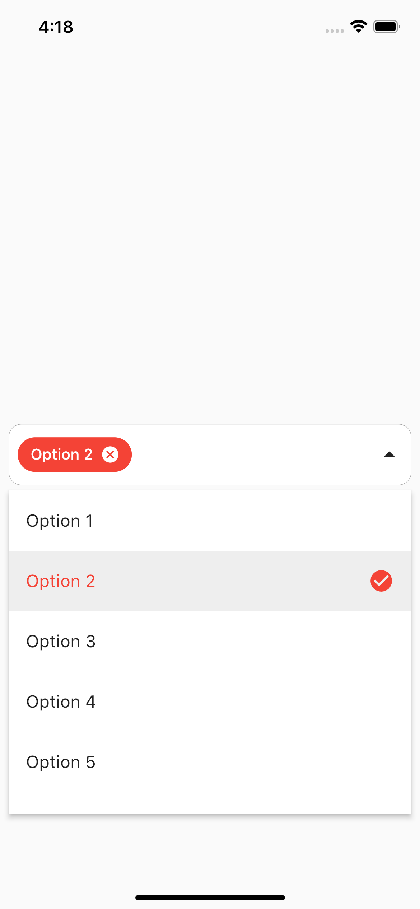

A dropddown package for flutter that allows you to select multiple items from a list.
You can customize the dropdown list items, the dropdown list style, and the dropdown field style.

## Preview

`Selection mode: single`

[](sample1.png)


`Selection mode: multiple`

[](sample2.gif)
[](sample2.gif)


## Features
-  Allows you to select multiple/single items from a list.
-  Shows the selected items as chips. You can customize the chip style.
-  Disable the dropdown items.
-  Preselect the dropdown items.
-  Customize dropdown list items.
-  Customize selected item builder.
-  Customize dropdown field style.


## Getting started

Add the following to your `pubspec.yaml`:

```yaml
dependencies:
  multiselect_dropdown: any
```

Run `flutter packages get`

## Example

```dart
import 'package:flutter/material.dart';
import 'package:multiselect_dropdown/multiselect_dropdown.dart';

void main() {
  runApp(const MyApp());
}

class MyApp extends StatelessWidget {
  const MyApp({Key? key}) : super(key: key);

  @override
  Widget build(BuildContext context) {
    return MaterialApp(
      title: 'Flutter Demo',
      theme: ThemeData(
        primarySwatch: Colors.red,
      ),
      home: const MyHomePage(),
    );
  }
}

class MyHomePage extends StatelessWidget {
  const MyHomePage({Key? key}) : super(key: key);

  @override
  Widget build(BuildContext context) {
    return Scaffold(
      body: Padding(
        padding: const EdgeInsets.all(8),
        child: Center(
            child: MultiSelectDropDown(
          onOptionSelected: (List<ValueItem> selectedOptions) {},
          options: const <ValueItem>[
            ValueItem(label: 'Option 1', value: '1'),
            ValueItem(label: 'Option 2', value: '2'),
            ValueItem(label: 'Option 3', value: '3'),
            ValueItem(label: 'Option 4', value: '4'),
            ValueItem(label: 'Option 5', value: '5'),
            ValueItem(label: 'Option 6', value: '6'),
          ],
          selectionType: SelectionType.multi,
          chipConfig: const ChipConfig(wrapType: WrapType.wrap),
          dropdownHeight: 300,
          optionTextStyle: const TextStyle(fontSize: 16),
          selectedOptionIcon: const Icon(Icons.check_circle),
        )),
      ),
    );
  }
}

```

## Additional information

## Parameters
   
    | Parameter                     | Description                         | Default | Required | 
    | ----------------------------- | ----------------------------------- | ------- | -------- |
    | selectionType                 | Type of selection. Single or multi. | multi   | No       |
    | hint                          | Hint text                           | select  | No       |
    | hintColor                     | Hint text color                     | grey    | No       |
    | hintFontSize                  | Hint text font size                 | null    | No       |
    | hintStyle                     | Hint text style                     | null    | No       |
    | options                       | List of options                     | null    | No       |
    | selectedOptions               | List of selected options            | null    | No       |
    | disabledOptions               | List of disabled options            | null    | No       |
    | onOptionSelected              | Callback when an option is selected | null    | Yes      |
    | selectedOptionIcon            | Icon for selected option            | check   | No       |
    | selectedOptionTextColor       | Selected option text color          | null    | No       |
    | selectedOptionBackgroundColor | Selected option background color    | null    | No       |
    | selectedItemBuilder           | Custom builder for selected option  | null    | No       |
    | showChipInSingleSelectMode    | Show chip in single select mode     | false   | No       |
    | chipConfig                    | Chip configuration                  | default | No       |
    | optionsBackgroundColor        | Options background color            | null    | No       |
    | optionTextStyle               | Options text style                  | null    | No       |
    | optionSeperator               | Options seperator                   | null    | No       |
    | dropdownHeight                | Dropdown height                     | 200     | No       |
    | alwaysShowOptionIcon          | Always show option icon             | false   | No       |
    | backgroundColor               | Background color                    | White   | No       |
    | suffixIcon                    | Suffix icon                         | arrow   | No       |
    | inputDecoration               | Input decoration                    | null    | No       |

